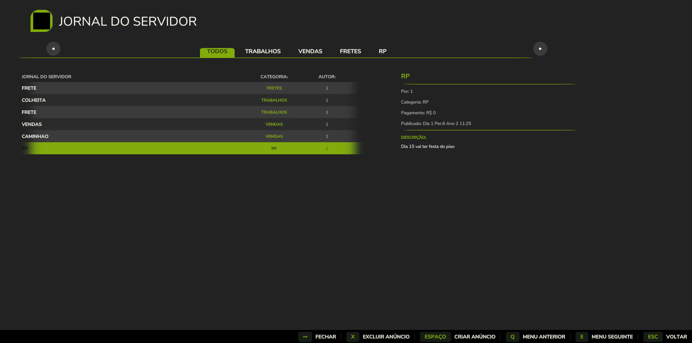
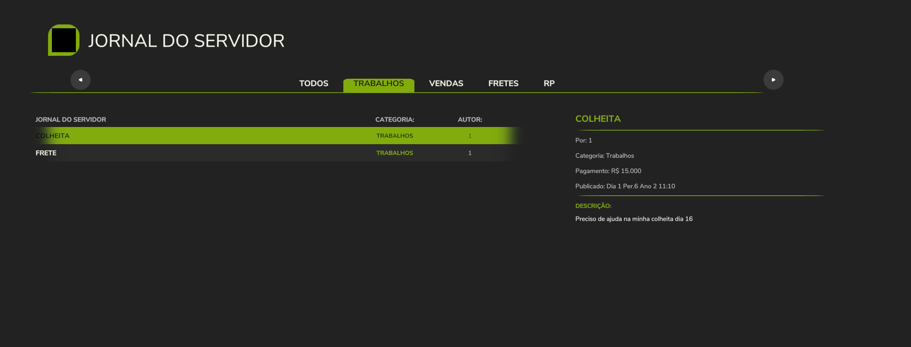
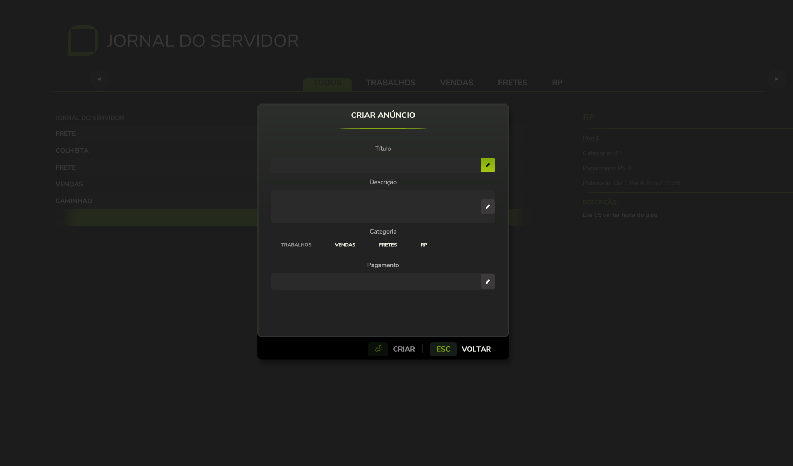

# Server Journal — FS25

  

  

---

## 📋 Informações / Information

| 🇧🇷 | 🇺🇸 |
|---|---|
| **Versão** | 1.0.6 |
| **Autor** | B.O.B ([github.com/eusouanderson](https://github.com/eusouanderson)) |
| **Categoria** | 📦 Outros / Other (Gameplay / HUD) |
| **Multiplayer** | ✅ Sincronização completa / Full sync |
| **Persistência** | Savegame |

## 📸 Screenshots

  

  
  

---

## 🇧🇷 Sobre

**Server Journal** (Jornal do Servidor) é um sistema de mural multiplayer para o **Farming Simulator 25**.
Jogadores podem visualizar anúncios em tempo real e criar posts para trabalhos, fretes, vendas e RP — tudo
sincronizado entre os clientes e salvo no savegame.

### Funcionalidades
- ✅ Criação e listagem de posts em tempo real
- ✅ Filtros por categoria: Trabalhos, Vendas, Fretes e RP
- ✅ Sincronização multiplayer completa (autoritativo no servidor)
- ✅ Persistência no savegame
- ✅ Interface nativa no estilo GIANTS Engine UI
- ✅ Ícone próprio no menu de pausa do jogo

### Como usar
1. Abra o **Jornal do Servidor** pelo atalho configurado em *Opções > Controles > "Abrir Jornal do Servidor"*
2. Navegue pelas categorias (TODOS, TRABALHOS, VENDAS, FRETES, RP) usando as abas superiores
3. Selecione um anúncio na lista para ver os detalhes à direita
4. Use **CRIAR ANÚNCIO** para publicar um novo post com título, descrição, categoria e pagamento

### Instalação
1. Baixe o arquivo ZIP abaixo
2. Extraia para `Documentos/My Games/FarmingSimulator2025/mods/`
3. Ative o mod **"Jornal do Servidor"** no menu de mods do jogo/servidor
4. Pronto!

---

## 🇺🇸 About

**Server Journal** is a multiplayer bulletin board system for **Farming Simulator 25**.
Players can view real-time announcements and create posts for jobs, freight, sales, and roleplay (RP) —
everything is synchronized across clients and persisted in the savegame.

### Features
- ✅ Real-time post creation and listing
- ✅ Category filters: Jobs, Sales, Freight, and RP
- ✅ Full multiplayer synchronization (server-authoritative)
- ✅ Savegame persistence
- ✅ Native GIANTS Engine-styled UI
- ✅ Custom icon in the game's pause menu

### How to use
1. Open the **Server Journal** with the keybind set in *Options > Controls > "Open Server Journal"*
2. Browse categories (ALL, JOBS, SALES, FREIGHT, RP) using the top tabs
3. Select a post in the list to see its details on the right
4. Use **CREATE POST** to publish a new entry with title, description, category, and payment

### Installation
1. Download the ZIP file below
2. Extract to `Documents/My Games/FarmingSimulator2025/mods/`
3. Enable the **"Server Journal"** mod in the game/server mod menu
4. Done!

---

## 📥 Download

**Server Journal v1.0.6**

[⬇ Baixar / Download](https://github.com/eusouanderson/fs25-mods/releases/tag/server-journal-v1.0.6)

---

  
   
  Criado por B.O.B — <a href="https://github.com/eusouanderson/fs25-mods">github.com/eusouanderson/fs25-mods</a>

