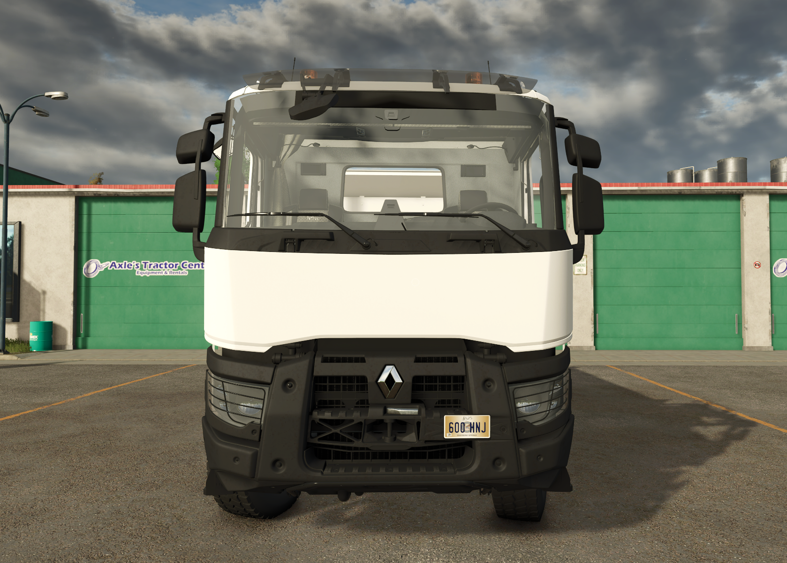
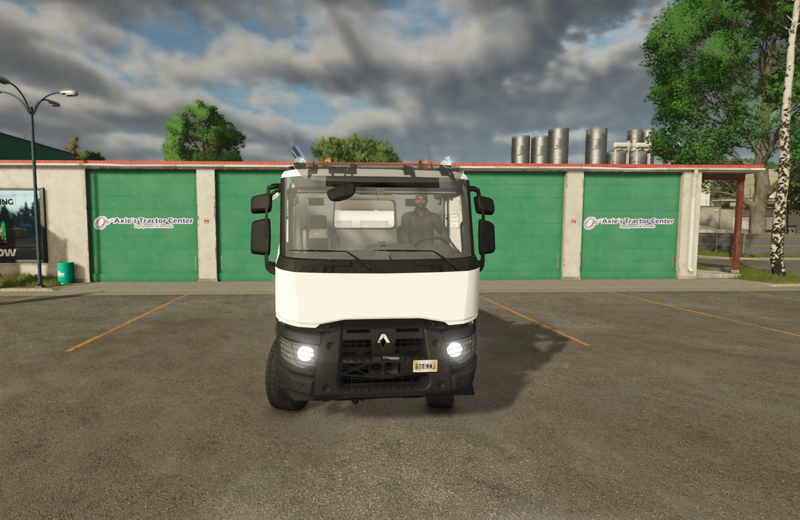

# Renault K480 6x4 — FS25

  

  

---

## 📋 Informações / Information

| 🇧🇷 | 🇺🇸 |
|---|---|
| **Versão** | 1.0.0 |
| **Autor original** | JM / SebFS / Cédric C / Ronan LAR TP |
| **Conversão** | B.O.B ([github.com/eusouanderson](https://github.com/eusouanderson)) |
| **Categoria** | 🚚 Caminhões / Trucks |
| **Preço** | 130.000€ |
| **Potência** | 480 hp |
| **Capacidade** | 20.000 L |

## 📸 Screenshots

  

  
  

  
  

---

## 🇧🇷 Sobre

Caminhão basculante **Renault K480 6x4** convertido do FS22 para o **Farming Simulator 25**.

### Características
- ✅ Conversão completa do FS22 para o FS25
- ✅ Colisões e texturas funcionando
- ✅ Caçamba basculante com descarga traseira, esquerda e direita
- ✅ Cor personalizável da cabine e caçamba
- ✅ Eixo 6x4 com 3 diferenciais
- ✅ Motor C480 de 500 hp
- ✅ Sistema de amarração (tension belts)
- ✅ Capacidade: 20.000 L
- ✅ Engate para reboques

### Instalação
1. Baixe o arquivo ZIP abaixo
2. Extraia para `Documentos/My Games/FarmingSimulator2025/mods/`
3. Pronto! O mod aparece no jogo.

---

## 🇺🇸 About

**Renault K480 6x4** tipper truck converted from FS22 to **Farming Simulator 25**.

### Features
- ✅ Full FS22 → FS25 conversion
- ✅ Working collisions and textures
- ✅ Tipper body with back, left, and right unloading
- ✅ Customizable cabin and tipper color
- ✅ 6x4 axle with 3 differentials
- ✅ C480 500 hp engine
- ✅ Tension belts system
- ✅ Capacity: 20,000 L
- ✅ Rear hitch for trailers

### Installation
1. Download the ZIP file below
2. Extract to `Documents/My Games/FarmingSimulator2025/mods/`
3. Done! The mod appears in the game.

---

## 📥 Download

**Renault K480 6x4 v1.0.0**

[⬇ Baixar / Download](https://github.com/eusouanderson/fs25-mods/releases/tag/renault-k480-6x4-v1.0.0)

---

  
   
  Convertido por B.O.B — <a href="https://github.com/eusouanderson/fs25-mods">github.com/eusouanderson/fs25-mods</a>

